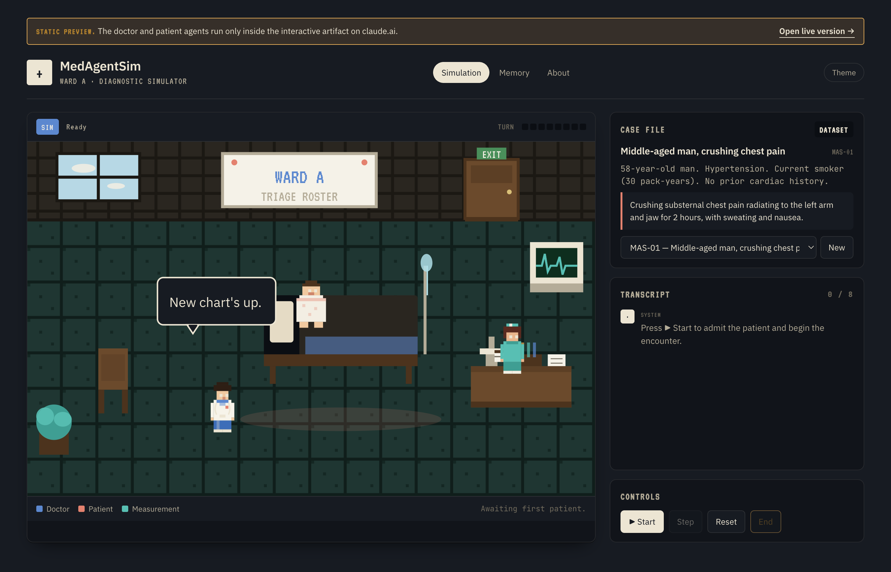

# MedAgentSim — single-page reproduction

A one-page pixel-art reproduction of **MedAgentSim** (Almansoori & Kumar, *MICCAI 2025*),
a multi-agent doctor / patient / measurement simulation for clinical diagnostic reasoning.



- **Paper**: <https://arxiv.org/abs/2503.22678>
- **Original code**: <https://github.com/MAXNORM8650/MedAgentSim>
- **Live interactive version** (needs Claude): <https://claude.ai/code/artifact/cb5e8486-97ef-40d1-8075-c46634c8d333>
- **Static preview on Pages**: <https://agr-333.github.io/medagentsim-artifact/>

The original ships a Django + Phaser hospital-game frontend backed by 70-billion-parameter
open-source LLMs served through vLLM. This repo keeps the essential loop and the pixel-hospital
feel in a single HTML file, and can talk to five different LLM backends (see below).

## Backends

The ⚙ Backend button in the top-right opens a settings panel. Pick one:

| Backend | Model | Where a key comes from | Notes |
|---|---|---|---|
| **Claude** | `sample` (default / complex / quick) | Uses `window.claude.use("sample")` — only inside a claude.ai artifact viewer | Best fidelity to the artifact's original design |
| **Groq** | Llama-3.3-70B-versatile (default) | <https://console.groq.com/keys> | Closest match to the paper's own doctor LLM. Free tier is generous |
| **DeepSeek** | `deepseek-chat` (default) or `deepseek-reasoner` | <https://platform.deepseek.com/api_keys> | Very low cost, solid reasoning |
| **Hugging Face** | `google/medgemma-4b-it` (default) | <https://huggingface.co/settings/tokens> | The medical model. MedGemma is gated — accept the license on its model page with the same account first |
| **Ollama** | `medgemma`, `llama3`, whatever you have pulled | Local | Start Ollama with `OLLAMA_ORIGINS='*' ollama serve` so the browser is allowed to call `localhost:11434` |

Keys are stored in `localStorage` and never sent anywhere except directly to the API you chose.

**CSP note**: inside a claude.ai artifact the sandbox blocks fetches to any host other than Claude — so on the artifact link only the **Claude** backend actually works. Use the GitHub Pages copy (or the raw HTML opened locally) for Groq / DeepSeek / MedGemma / Ollama.

## What's in the page

- A tiled Ward A drawn in inline SVG (whiteboard, exam bed with IV pole, vitals monitor with
  a live trace, lab desk with test-tube rack, plant, chairs). Three sprites — doctor, patient,
  nurse — walk between stations as the encounter progresses.
- A live multi-agent loop:
  - **Doctor** — `sample.json({modelTier: "default"})`. Each turn returns
    `{reasoning, action}` where `action` is `ask` / `exam` / `diagnose`.
  - **Patient** — `sample({modelTier: "quick"})`. Role-plays from the hidden HPI and never
    reveals the diagnosis.
  - **Measurement** — bundled ground-truth lookup for the case's tests, with a Claude fallback
    for out-of-pack orders.
- 8 bundled cases (STEMI, meningococcal meningitis, new-onset T2DM, Hashimoto hypothyroidism,
  small-cell lung cancer, symptomatic cholelithiasis, spontaneous pneumothorax, active TB).
- Experience-replay memory in `localStorage` — correct diagnoses are stored and retrieved as
  few-shot context on later cases.
- Dark and light themes, both hand-tuned.

## Running it

**On claude.ai** (recommended — the agents actually run):

Open the live artifact link at the top of this README.

**Locally / on GitHub Pages** (UI only, no agents):

```
open index.html      # macOS
```

`window.claude` only exists inside a claude.ai artifact viewer, so on a plain host such as
GitHub Pages the page renders but pressing **Start** cannot reach the doctor / patient
LLMs — a banner at the top of the page points to the live version.

## Citing the paper

```bibtex
@inproceedings{almansoori2025medagentsim,
  title  = {MedAgentSim: Self-Evolving Multi-Agent Simulations
            for Realistic Clinical Interactions},
  author = {Mohammad Almansoori and Komal Kumar and Hisham Cholakkal},
  booktitle = {MICCAI},
  year   = {2025}
}
```

## License

Released under **Creative Commons Attribution-NonCommercial-ShareAlike 4.0**
(CC BY-NC-SA 4.0), matching the license of the upstream MedAgentSim repository.
See [`LICENSE`](./LICENSE).

## Notes

- Bundled cases are original vignettes written in the style of NEJM / MedQA — they are
  **not** verbatim from either dataset.
- Diagnostic verdict is a case-insensitive substring / alias match against ground truth.
- This is a research / educational demo. It is not a diagnostic tool.
